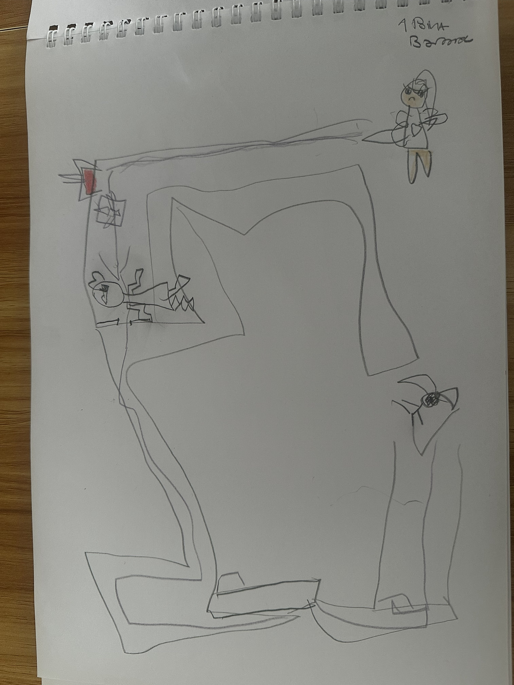

# Mazoole ✏️

**Mazes drawn by hand, played together.**

Mazoole started as pencil drawings in a spiral notebook, made by a parent and
daughter together. This repo turns those drawings into a small co-op browser game that
keeps the look of the notebook: wobbly pencil walls, crayon colors, stick-figure
heroes.



## Play

Open `index.html` in a browser. There's no install and no build step. Double-clicking the file works.

| Who | Keys | Tablet / phone |
|---|---|---|
| **Hero** (player 1, red cape) | `W` `A` `S` `D` | left pad |
| **Fairy** (player 2, butterfly wings) | arrow keys | right pad |
| Restart the level | `R` | ↺ button |
| Menu | `Esc` | ☰ button |

In 1-player mode, both the arrow keys and WASD move the hero.

**Goal:** reach the gift (or rescue the friend in bed). If *either* player gets
there, you both win. You share 5 hearts.

| Thing | What it does |
|---|---|
| 🔴 button in a picture frame | Step on it and the door of the same color opens for good |
| 🟡 key | Opens one scribbled lock door |
| 🦋 wings | Fly over walls for 6 seconds. A ring shows the time left and turns red near the end. Flying also keeps you safe from traps, monsters and spiders |
| ⭐ star | Bonus. Some are sealed inside boxes, so you need wings to reach them |
| 💔 staircase with a broken heart | Trap. Costs a heart unless you fly over it |
| Spiky green monster, spider | Walk back and forth. Dodge them using the side nooks |
| Angry fairy | Shoots a sparkle beam down her corridor. A dotted line warns you before she fires. Wait in a nook and then run! |

## What we saw in the drawings

The **castle drawing** (`drawings/castle-rescue.jpg`) became level 3, *Rescue in the Tower*:
- The caped stick figure at the bottom left is **the hero** and the starting point.
- The girl lying on the bed in the tower is **the friend to rescue**, which is the goal.
- The smiling girl holding something yellow gives you **the key**. The scribbled
  door beside her is **the lock**.
- The staircase with the broken heart became the **broken-heart traps**.
- The box with a square inside became the **sealed star box**. You need wings to get in.
- The girl flying near the top gave us **the wings power-up**.
- The big angry fairy on the right became the **fairy who shoots a beam**.
- The little framed picture in the corner became the **button** that opens the red door.

The **long corridor drawing** (`drawings/bina-corridor.jpg`) became level 2, *Bina's Corridor*:
- The red door with the present at the end is **the gift** (the goal).
- The spiky creature with teeth is **the monster**. The spider on the right is **the spider**.
- The angry fairy's long line aimed along the top is **the beam**.

Level 1, *Pencil Practice*, is a short tutorial that teaches each item once.

## Make your own maze

**In the game:** open the menu and choose **✏️ Draw your own maze**. Pick a tool
and paint with the mouse or a finger, then press **Play it!**. Your maze is saved in the
browser and appears in the menu. Press **Copy level** to get its text.

**In code:** every level is a small text drawing in [`js/levels.js`](js/levels.js),
one character per square:

```
#  wall             .  floor           1  hero start      2  fairy start
G  goal             a b c  buttons     A B C  doors (same letter)
k  key              L  lock door       w  wings           *  star
h  heart trap       m  monster         s  spider          F  angry fairy
```

Paste a copied level into the `MAZOOLE_LEVELS` list and it shows up in the menu.

## How it's built (for grown-ups)

It's plain HTML, CSS and JavaScript, with no framework, no build step and no dependencies apart from one Google Font. The renderer falls back to Comic Sans if the font doesn't load.

| File | Job |
|---|---|
| `js/draw.js` | Pencil-style drawing: wobbly strokes, crayon fill, every sprite. Characters "boil" (redraw with new wobble) 6× a second, like hand-drawn animation. |
| `js/levels.js` | The levels as text maps |
| `js/game.js` | Grid movement, buttons and doors, keys, wings, monsters, fairy beams, hearts, co-op input, touch pads, sound effects (small WebAudio beeps, no audio files) |
| `js/editor.js` | The in-game maze painter |

Design choices:
- **Movement is tile by tile, animated smoothly.** Collisions stay simple and exact, it's easy for young players, and levels can be written as text.
- **Buttons stay pressed** so the game works for one player. Co-op comes from splitting up: one player dodges the monster while the other goes for the key.
- **No softlocks.** If the wings run out over a wall, you drift down to the nearest floor. If you land in a sealed room, you float back to where you picked up the wings.

### Deploy
The site is static, so any static host works. On GitHub Pages, go to Settings → Pages, choose "Deploy from branch" and pick the branch.

## Ideas for next time
- **Photo to maze:** take a picture of a new drawing and get a playable grid
  automatically (threshold the image, detect the pencil lines, snap them to a grid). The
  text-map format was chosen so this can be added later without touching the game.
- Use the original photo, faded, as the level background.
- Record the kids' voices for the sound effects.
- More powers: shrink to fit through cracks, a lantern for dark mazes, a time-freeze.
- Pressure plates that only work while someone stands on them, for puzzles that need both players.
